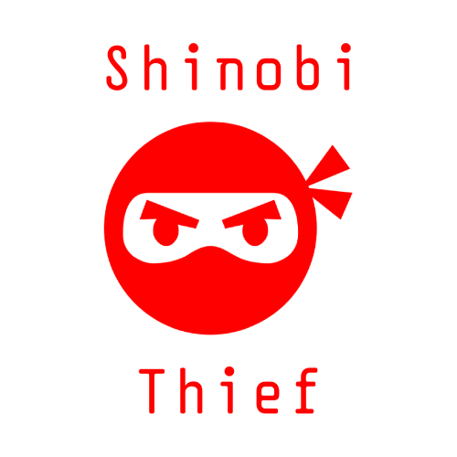

# Shinobi Thief

  

## Project

Video Game developed for the Electronic Games 2023 course at Universitat Pompeu Fabra.

Students:
* Aniol Medico Soldevila - NIA: 239467 - aniol.medico01@estudiant.upf.edu
* Manuel Félix Parma - NIA: 255570 - manuelfelix.parma01@estudiant.upf.edu 

### Implemented Features

M: Manuel, A: Aniol.

* AI (M)
* Animations (A)
* Assets (M & A)
* Balancing (M)
* Camera (A)
* Collisions (M)
* Entities (M)
* Map design (A)
* Shaders (M)
* Sound (M)
* Stages (A)
* UI (A)
* World (M & A)

### Framework

The proyect was designed to run on the [TJE Framework](https://github.com/upf-gti/TJE_Framework)
which is a C++ Visual Studio solution (refer to the linked repository for more information).

### Notes

* Use the F3 key to activate in game performance stats (FPS and similar).
* Use the ESC key to return to main menu.

## Game Description

You play as a ninja in feudal Japan tasked with stealing a precious gem from an enemy encampment.
Explore the village to find the artifact, avoiding enemies and then return to your
intial position to escape from the camp and win the level!. Use your abilities to
be the best ninja possible. But careful! The artifact you are recovering is very heavy
effect, so you won't be able to use some of your abilities after obtaining it.

### Abilities
* Moving (WASD): essential to any ninja.
* Jumping (Space Bar): use your jump to quickly traverse the level.
* Dashing (Q): get away from enemies fast by getting a boost.
* Marking (E): mark the enemy currently in your crosshair to be able to see them through walls.
* Sneaking (F): turn invisible for a few moments to keep enemies from seeing you.
* Croushing (Left Shift): being in a lower stance makes you harder to see from away.

## Resources Used
* [Tamat's website](https://tamats.com/) (various tools)
* [Freesound](https://freesound.org/)
* [Sketchfab](https://sketchfab.com)
* [Blender](https://www.blender.org/)
